# Amazon SageMaker Model Serving using AWS CDK

This repository provides AI/ML service(MachineLearning model serving) modernization solution using [Amazon SageMaker](https://aws.amazon.com/sagemaker), [AWS CDK](https://aws.amazon.com/cdk), and [AWS Serverless services](https://aws.amazon.com/serverless).

A guide and demonstration of this solution can be found in:

- [AWS Innovate 2021 AIML Edition](https://www.youtube.com/watch?v=kn2DBjZW5W8&t=1588s)

Other "Using AWS CDK" series can be found in:

- [AWS ECS DevOps Using AWS CDK](https://github.com/aws-samples/aws-ecs-devops-using-aws-cdk)
- [AWS IoT Greengrass Ver2 Using AWS CDK](https://github.com/aws-samples/aws-iot-greengrass-v2-using-aws-cdk)
- [AWS Serverless Using AWS CDK](https://github.com/aws-samples/aws-serverless-using-aws-cdk)

## Contents

1. [**Repository structure**](#repository-structure)

2. [**Solution coverage**](#solution-coverage)
  
3. [**Solution approach**](#solution-approach)

4. [**Solution architecture**](#solution-architecture)

5. [**How to prepare ML model**](#how-to-prepare-ml-model)

6. [**How to deploy**](#how-to-deploy)

    - [**Prerequisites**](#prerequisites)
    - [**How to set up**](#how-to-set-up)
    - [**How to provision**](#how-to-provision)

7. [**How to test**](#how-to-test)

8. [**How to monitor**](#how-to-monitor)

9. [**How to change model and endpoint configration**](#how-to-change-model-and-endpoint-configration)

10. [**How to set up auto-scaling**](#how-to-set-up-auto-scaling)

11. [**How to add model-b**](#how-to-add-model-b)

12. [**How to configure Logging-Path**](#how-to-configure-logging-path)

13. [**About CDK-Project**](#about-cdk-project)

14. [**How to clean up**](#how-to-clean-up)

15. [**Security**](#security)

16. [**License**](#license)

## **Repository structure**

This repository is basically a CDK-Project, but it is organized as follows so that MLDevOps(ML Scientist + SW Developer + Infra Operator) can collaborate.

- bin/stack directory: for Infra Operator
- codes/lambda directory: for SW Developer
- models/model-a: for ML Scientist
- config/app-config.json: a place where all developer(MLDevOps) can collaborate, ***Configuration Driven Development*** approach can coordinate each other's interfaces through configuration.

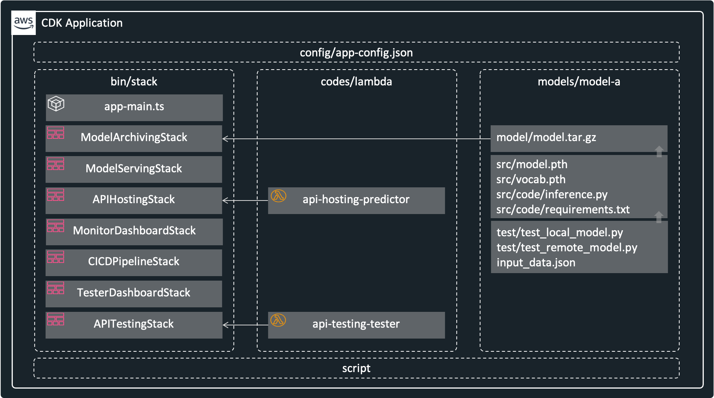

## **Solution coverage**

When considering AI/ML services development & operation (DevOps), there are various considerations other than model serving. For example, A/B testing, monitoring, data collection, etc. should be considered together for continuous service improvement. To meet these considerations, this solution covers the areas highlighted in the figure below.

- Model Deployment: Models Archiving, Multiple Models Serving, Realtime Prediction
- Monitoring & Debugging: Endpoint Testing, Resource Monitoring
- Data Collection: Inference History Logging

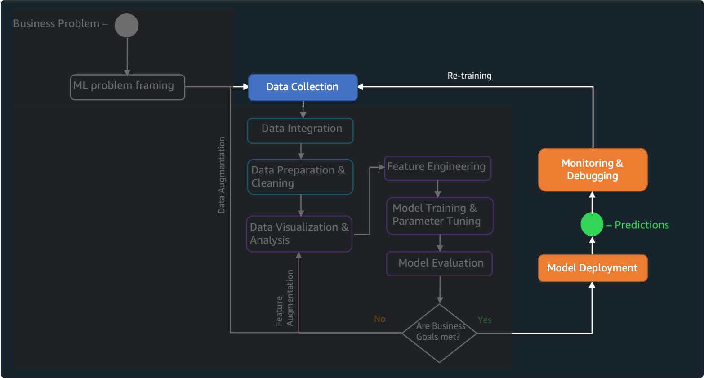

## **Solution approach**

In order to agile development and operation of such complex **AI/ML services**, we approach from [**Application Modernization**](https://aws.amazon.com/modern-apps) perspective, which can be summarized into features such as:

- Application Architecture: Modular Microservices
- Software Delivery: Automation, Abstraction, & Standardization
- Data Strategy: Decoupled & Purpose Built
- Operations: As Serverless as Possible
- Management & Governance: Programmatic Guardrails

Finally, we can design the architecture by placing the following services in the right place.

- Application Architecture: as small as possible and divide it into the multiple stacks
- Software Delivery: CICD-based and IaC-based automation deploy
- Data Strategy: individual storage selection for each logging purpose
- Operations: only serverless and container
- Management & Governance: monitoring & testing

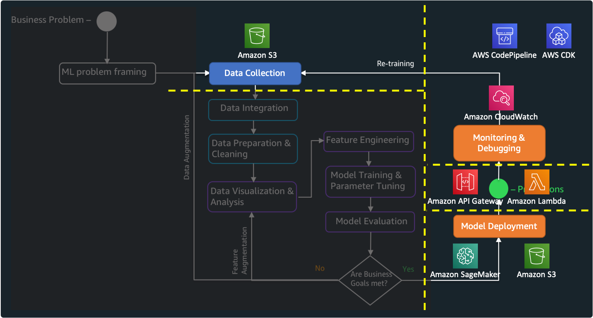

## **Solution architecture**

Basically this architecture is designed to provide a realtime endpoint using ML models. In this architecture, ***Application Modernization*** approach was applied to develop and operate agile and stable services.

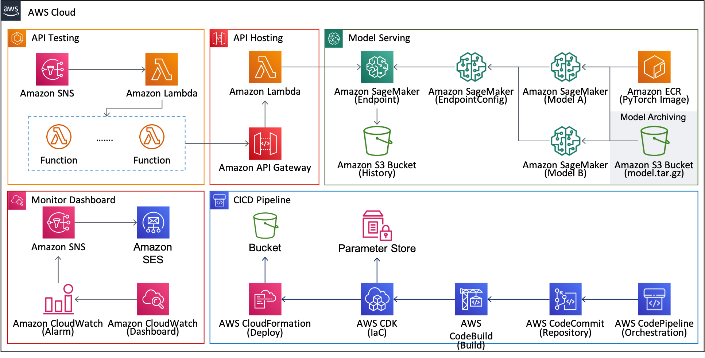

Each stack provides the follwing functions. In particular, the common functions of each stack are provided through ***BaseStack*** class by utilizing the characteristics of an object-oriented programming. Parameters such as resource name/ARN are shared between each stack through ***Parameter Store*** in AWS Systems Manager.

- Model Archiving Stack: Model Bucket Creation, model.tar.gz file Uploading
- Model Serving Stack: Models Loading, Multiple Models(A/B Testing) Serving, Inference Input/Output Logging
- API Hosting Stack: Serverless API Endpoint & Http Request Handling
- Monitor Dashboard: Serverless Resource Monitoring & Alarm
- CICD Pipeline: Continuous Integration & Continuous Deploy
- API Testing: Serverless Tester Agent
- Tester Dashboard: Testing State Monitoring

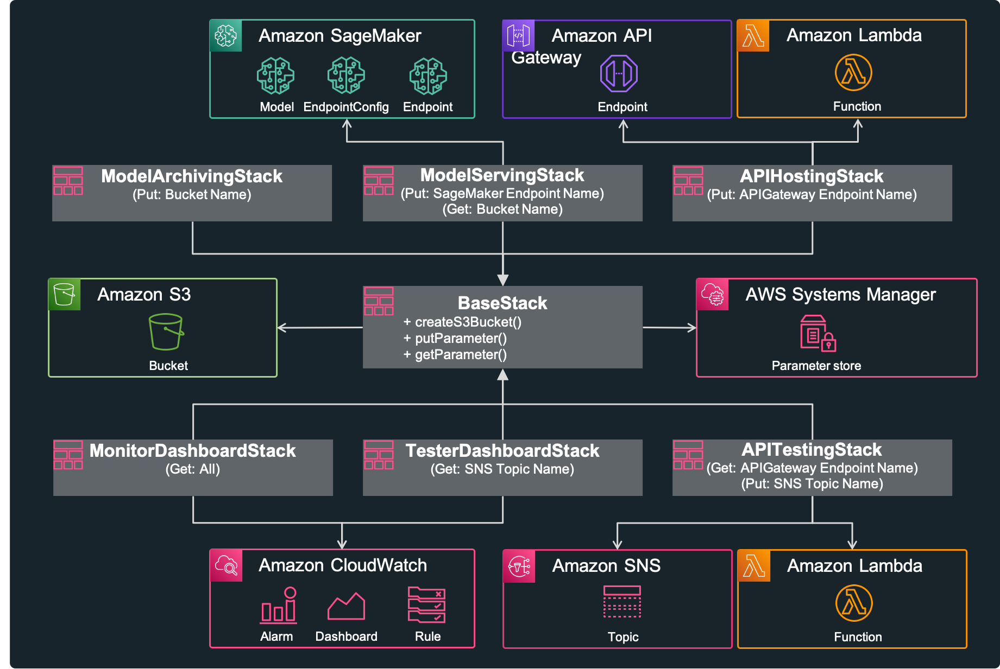

AWS services used are as follows:

- [Amazon SageMaker](https://aws.amazon.com/sagemaker): the most comprehensive ML service, which helps data scientists and developers to prepare, build, train, and deploy high-quality machine learning(ML) models quickly by bringing together a broad set of capabilities purpose-built for ML
- [Amazon API Gateway](https://aws.amazon.com/api-gateway): a fully managed service that makes it easy for developers to create, publish, maintain, monitor, and secure APIs at any scale
- [Amazon Simple Storage Service(S3)](https://aws.amazon.com/s3): object storage built to store and retrieve any amount of data from anywhere
- [Amazon Lambda](https://aws.amazon.com/lambda): a serverless computing which run code without thinking about servers
- [Amazon Simple Notification Service(SNS)](https://aws.amazon.com/sns): a fully managed messaging service for both application-to-application (A2A) and application-to-person (A2P) communication
- [Amazon Simple Email Service(SES)](https://aws.amazon.com/ses): a cost-effective, flexible, and scalable email service that enables developers to send mail from within any application
- [Amazon CloudWatch](https://aws.amazon.com/cloudwatch): a monitoring and observability service built for DevOps engineers, developers, site reliability engineers (SREs), and IT managers
- [Amazon System Manager Parameter Store](https://docs.aws.amazon.com/systems-manager/latest/userguide/systems-manager-parameter-store.html): secure, hierarchical storage for configuration data management and secrets management
- [AWS CodePipeline](https://aws.amazon.com/codepipeline): a fully managed continuous delivery service that helps you automate your release pipelines for fast and reliable application and infrastructure updates
- [AWS CloudFormation](https://aws.amazon.com/cloudformation): an easy way to model a collection of related AWS and third-party resources, provision them quickly and consistently, and manage them throughout their lifecycles, by treating infrastructure as code
- [AWS Cloud Development Kit(CDK)](https://aws.amazon.com/cdk): an open source software development framework to define your cloud application resources using familiar programming languages

## **How to prepare ML model**

Becuase this solution assumes that the model is previously provided by data scientists, ML model training and tuning is outside the scope of this solution. So we use the simple example model for the purpose of model serving. We will use Pytorch-based [text classification model](https://github.com/pytorch/text/tree/master/examples/text_classification) which is provided in [**pytorch/text**](https://github.com/pytorch/text).

In any directory, execute the following commands to train model and finally get ML model file(***model.pth***) and vocabulary file(***vocab.pth***). These commands train Text-Classification model using AG_NEWS dataset under CPU environment. This model takes text as input and classifies one of the following four labels.

- 1: 'World'
- 2: 'Sports'
- 3: 'Business'
- 4: 'Sci/Tech'

If you are not ready for pytorch, please refer to this [installation guide](https://github.com/pytorch/text#installation). In this repository, pytorch version is 1.8.0, torchtext version is 0.9.0.

```bash
git clone https://github.com/pytorch/text.git torchtext  
cd torchtext/examples/text_classification/  
mkdir .data  
python3 train.py AG_NEWS --device cpu --save-model-path  model.pth --dictionary vocab.pth  
```

Finally copy model script(***model.py***) and training outputs(***model.pth***, ***vocab.pth***) into ***models/model-a/src*** directory of this repository.

```bash
cp ./model.py ../../../amazon-sageMaker-model-serving-using-aws-cdk/models/model-a/src/code/  
cp ./model.pth ./vocab.pth ../../../amazon-sageMaker-model-serving-using-aws-cdk/models/model-a/src/  
```

This is a intermediate tree view in "models/model-a/src" directory.

```bash
models
└── model-a
    ├── src
    │   ├── code
    │   │   ├── inference.py
    │   │   ├── model.py       <--- this file is from pytorch/text
    │   │   └── requirements.txt
    │   ├── model.pth          <--- this file is from pytorch/text
    │   └── vocab.pth          <--- this file is from pytorch/text
    └── test
        ├── input_data.json
        ├── test_local_model.py
        └── test_remote_model.py
```

To create SageMaker Endpoint(realtime inference), We need to prepare two, the first is the model file(in here model.pth, vocab.pth) and the second is the associated script codes(in here inference.py, model.py). If we compress and upload these two into Amazon S3, Amazon SageMaker will load ***inference.py*** and call methods(model_fn, input_fn, predict_fn, output_fn) implemented in this file. And SageMaker install the additional dependecies using requirements.txt file. The figure below shows the abstract flow. Please check [SageMaker Python SDK - Deploy PyTorch Models](https://sagemaker.readthedocs.io/en/stable/frameworks/pytorch/using_pytorch.html#deploy-pytorch-models) for more details.

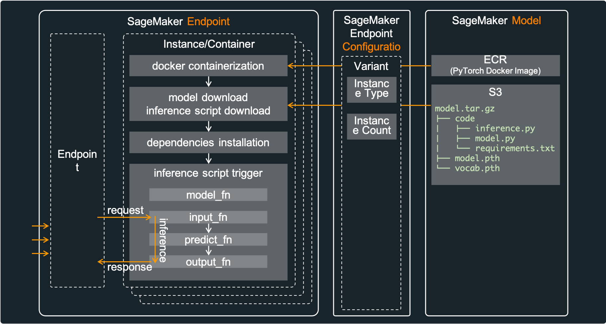

Now, let's test this model and inference scripts locally. It is very important to verify locally before deployment. Execute the following commands in root directory of this repository.

```bash
cd models/model-a/test  
python3 test_local_model.py  
...
...
-------------------------------------------------------------------
[tc-001]: result==>{"success": "true", "label": 1}
[tc-001]: completed==>The new president has called for an emergency conference for international cooperation.
-------------------------------------------------------------------
[tc-002]: result==>{"success": "true", "label": 2}
[tc-002]: completed==>Baseball is one of the most popular sports in the United States.
-------------------------------------------------------------------
[tc-003]: result==>{"success": "true", "label": 3}
[tc-003]: completed==>Stock investing has higher returns in the long run.
-------------------------------------------------------------------
[tc-004]: result==>{"success": "true", "label": 4}
[tc-004]: completed==>The development of science accelerated the development of mankind.
```

Finally compress these files to upload into Amazon S3. Execute the following command in root directory of this repository. This command will create ***model.tar.gz*** in "models/model-a/model", which will be uploaded to Amazon S3 through AWS CDK(***ModelArchivingStack***) later.

```bash
sh script/pack_models.sh  
```

This is a final tree view in "models/model-a/src" directory. Please make a note of that path(***models/model-a/model***) as it will be referenced later in [**How to configure**](#how-to-configure) step.

```bash
models/
└── model-a
    ├── model
    │   └── model.tar.gz
    ...
    ...
```

## **How to deploy**

To efficiently define and provision serverless resources, AWS CDK is utilized. Because AWS CDK uses familiar programming languages for modeling modern applications, we can provision in a safe, repeatable manner through AWS CloudFormation.


Because this solusion is implemented in CDK, we can deploy these cloud resources using CDK CLI. Among the various languages supported, this solution used typescript. Because the types of **typescript** are very strict, with the help of auto-completion, typescrip offers a very nice combination with AWS CDK.

***Caution***: This solution contains not-free tier AWS services. So be careful about the possible costs. Fortunately, serverless services minimize cost if not used(Amazon SageMaker's Endpoint is not serverless).

### **Prerequisites**

First of all, AWS Account and IAM User is required. And then the following must be installed.

- AWS CLI: aws configure --profile [profile name]
- Node.js: node --version
- AWS CDK: cdk --version
- [jq](https://stedolan.github.io/jq/): jq --version

Please refer to the kind guide in [CDK Workshop](https://cdkworkshop.com/15-prerequisites.html).

### **How to set up**

First of all, enter your project basic configuration in the follwoing document: ***config/app-config.json***. Fill in your project's "Name", "Stage", "Account", "Region", "Profile(AWS CLI Credentials)" in "Project" according to your environments.

```json
{
    "Project": {
        "Name": "TextClassification",
        "Stage": "Demo",
        "Account": "75157*******",
        "Region": "us-east-2",
        "Profile": "cdk-demo"
    },
    ...
    ...
}
```

If you don't know AWS Account/Region, execute the following commands to catch your AWS-Account.

```bash
aws sts get-caller-identity --profile [your-profile-name]
...
...
{
    "Account": "[account-number]", 
    "UserId": "[account-id]", 
    "Arn": "arn:aws:iam::12345678912:user/[iam-user-id]"
}
```

And then execute the following commands to set up CDK-Project. For details, please check **setup_initial.sh** file.

```bash
sh ./script/setup_initial.sh  
```

### **How to provision**

Let's check stacks included in this CDK-Project before provisining. Execute the following command. The prefix "***TextClassificationDemo***" can be different according to your setting(Project Name/Stage).

```bash
cdk list
...
...
TextClassificationDemo-APIHostingStack
TextClassificationDemo-APITestingStack
TextClassificationDemo-CICDPipelineStack
TextClassificationDemo-ModelArchivingStack
TextClassificationDemo-ModelServingStack
TextClassificationDemo-MonitorDashboardStack
TextClassificationDemo-TesterDashboardStack
```

Each item in "Stack" of ***app-config.json*** represents a stack of the same name. Each stack performs the follwoing roles:

- TextClassificationDemo-ModelArchivingStack: create S3 Bucket, and upload model.tar.gz into S3 Bucket
- TextClassificationDemo-ModelServingStack: create SageMaker Model, EndpointConfiguration, Endpoint, and Inference Input/Output Logging(Data capture)
- TextClassificationDemo-APIHostingStack: create API Gateway and Lambda Function
- TextClassificationDemo-MonitorDashboardStack: create CloudWatch Dashboard, Alarm, SNS, and SES
- TextClassificationDemo-CICDPipelineStack: create CodePipeline, CodeBuild
- TextClassificationDemo-APITestingStack: create SNS and Lambda Functions
- TextClassificationDemo-TesterDashboardStack: create CloudWatch Dashboard to present test results

Now, everything is ready, let's provision all stacks using AWS CDK. Execute the following command which will deploy all stacks in order of subordination.

```bash
sh script/deploy_stacks.sh
```

## **How to test**

For testing, execute the following command, which will send SNS message and finally the lambda functions will be executed to call API Gateway.

```bash
sh script/trigger_tests.sh
...
...
{
    "MessageId": "e78906f5-4544-5e19-9191-5e9ea2a859bd"
}
```

The number of tester lambda(TestClientCount) can be modified. Just change ***TestClientCount*** in ***app-config.json***, and then deploy ***TextClassificationDemo-APITestingStack*** again.

```json
...
        "APITesting": {
            "Name": "APITestingStack",

            "SNSTopicName": "TestTrigger",

            "LambdaFunctionName": "TestTrigger",
            "TestClientCount": 5
        },
...
```

And test duration(DurationInSec), and test interval(IntervalInSec) can be modified according to your test scenario. Please change ***input_data.json*** in ***script*** directory which is the message of SNS.

```json
...
{
    "Config": {
        "IntervalInSec": 10,
        "DurationInSec": 600
    },
...
...
```

## **How to monitor**

After a while, go to CloudWatch Dashboard(TextClassificationDemo-MonitorDashboard, TextClassificationDemo-TesterDashboard) and check the results.

***TextClassificationDemo-TesterDashboard***

This dashboard describes testing status. In the dashboard below, 1 SNS message was pulished and 5 lambda functions received that. ***ResponseTime-ApiGateway***, ***SuccessSum-ApiGateway***, and ***FailSum-ApiGateway*** are custom metrics sent by TesterLambda. this dashboard show that response time is about 0.05ms(this metric can be different according your environment). It can be seen that all test cases were successful, and none failed.
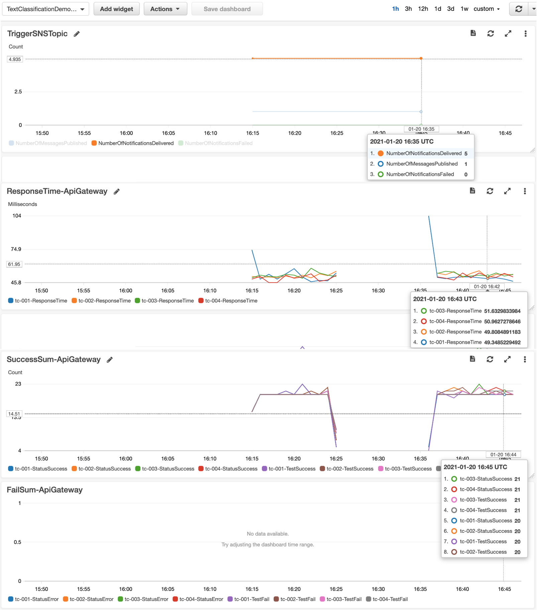

***TextClassificationDemo-MonitorDashboard***

This dashboard is the current status of all resources. The following picture shows realtime status of API Gateway, Lambda function, and SageMaker Endpoint.

MonitorDashboard-ApiGateway
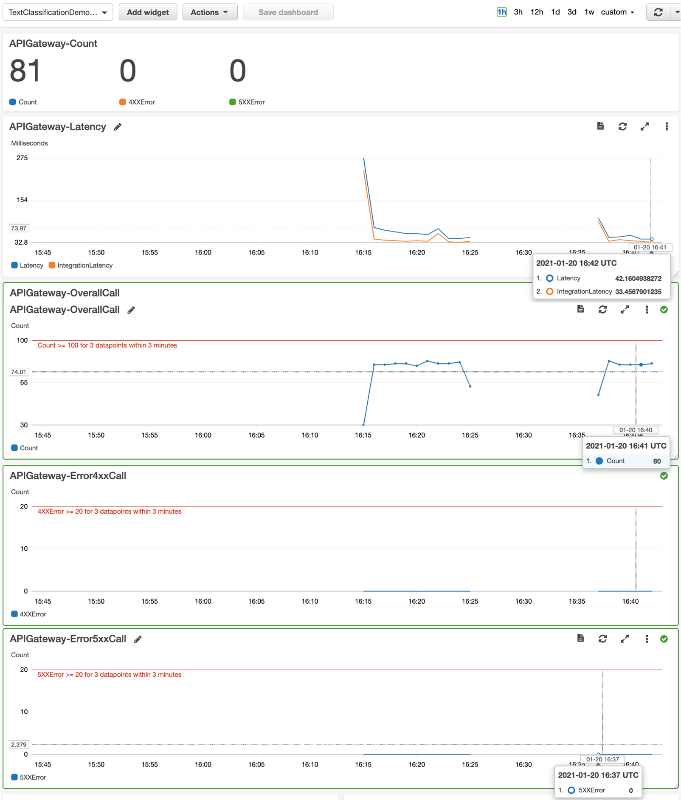

MonitorDashboard-Lambda
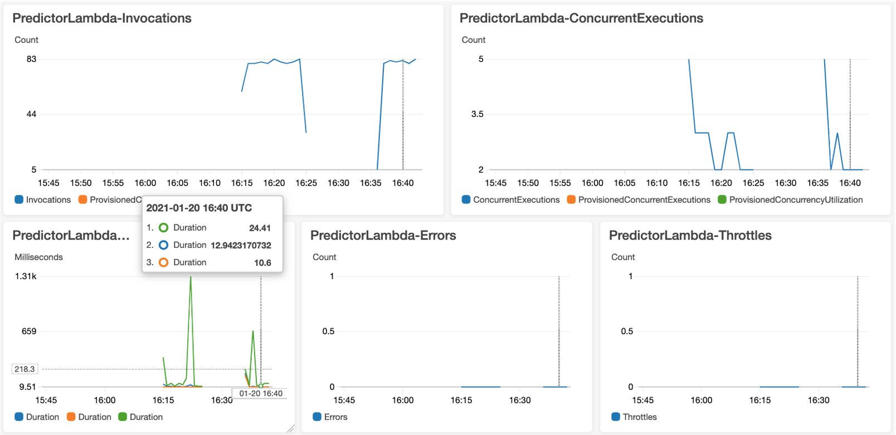

MonitorDashboard-SageMaker-Endpoint
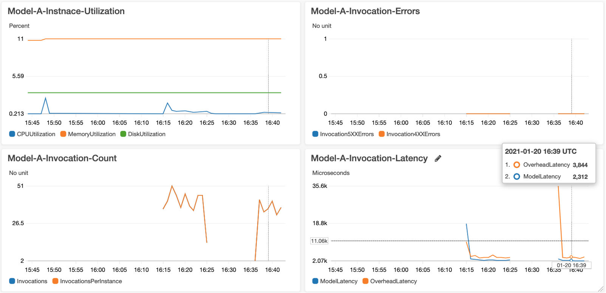

***Inference History Logging - S3 Bucket***

The following picture shows the logging results in S3 Bucket.

Inference-History-Bucket
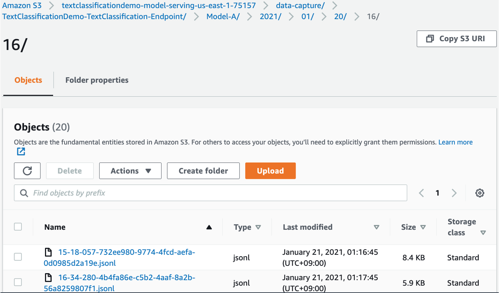

Inference-History-Jsonl
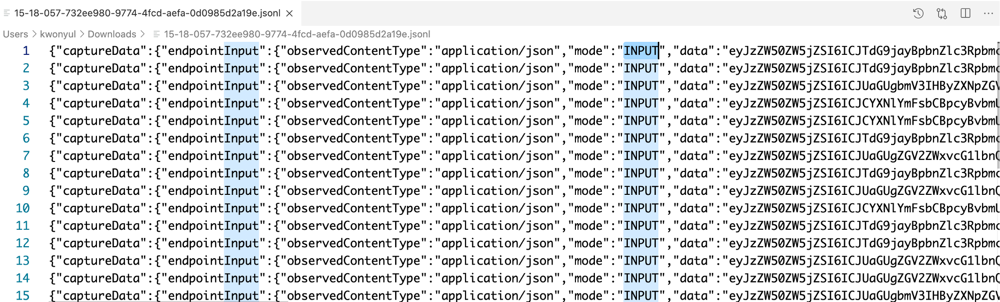

Also alarm threshold(ApiGatewayOverallCallThreshold, ApiGatewayError4xxCallThreshold, ApiGatewayError5xxCallThreshold) can be modified according to your operation scenario. Just change these items in ***app-config.json***, and then deploy ***TextClassificationDemo-MonitorDashboard***.

And change SES subscription email address in ***config/app-config.json***, which will send subscription confirmation mail to "SubscriptionEmails".

```json
...
        "MonitorDashboard": {
            "Name": "MonitorDashboardStack",

            "DashboardName": "MonitorDashboard",

            "SubscriptionEmails": ["abc@amazon.com", ....],
            "ApiGatewayOverallCallThreshold": 100,
            "ApiGatewayError4xxCallThreshold": 20,
            "ApiGatewayError5xxCallThreshold": 20
        },
...
```

Finally deploy and test again like this. ***script/deploy_stacks.sh** will deploy only changed stacks such as ***TextClassificationDemo-APITestingStack***, ***TextClassificationDemo-TesterDashboardStack***, TextClassificationDemo-MonitorDashboard.

```bash
sh script/deploy_stacks.sh
sh script/trigger_tests.sh
```

## **How to change model and endpoint configration**

After initial deployment, you can change to a new model file(ModelS3Key, ModelLocalPath) or change deployment settings(InstanceCount, InstanceType). If you change these settings, you must change ***ModelName***, ***EndpointConfigName***. This is mandantory, because SageMaker Model/EndpointConfig does not support to edit these values. In other words, changing these names will delete the previous Model/EndpointConfig and creat a new Model/EndpointConfig.
If you have already ***model.tar.gz*** file in S3 Bucket so you don't need upload a local ***model.tar.gz*** file, keep ***ModelLocalPath*** empty.

```json
      "ModelServing": {
            "Name": "ModelServingStack",

            "ModelList": [
                {
                    "ModelName":   "Model-A-20210117a", <-- change ModelName if ModelS3Key or ModelDockerImage is modified, and then change EndpointConfigName also
                    "ModelS3Key":     "models/model-a/model",
                    "ModelDockerImage": "763104351884.dkr.ecr.us-east-2.amazonaws.com/pytorch-inference:1.8.1-cpu-py36-ubuntu18.04",
                    
                    "VariantName": "Model-A",
                    "VariantWeight": 1,
                    "InstanceCount": 1,
                    "InstanceType": "ml.c4.xlarge",

                    "AutoScalingEnable": false,
                    "AutoScalingMinCapacity": 1,
                    "AutoScalingMaxCapacity": 3,
                    "AutoScalingTargetInvocation": 70
                }
            ],

            "EndpointConfigName":   "TextClassification-20210117c", <--- change EndpointConfigName if ModelName or VariantName or VariantWeight or InstanceCount or InstanceType
            "BucketBaseName": "model-serving",

            "EndpointName":      "TextClassification",
            "Deploy": true
        }
```

## **How to set up auto-scaling**

We can activate/deactivate auto-scaling feature of SageMaker Endpoint. Since this is a runtime option, you can activate/deactivate it while SageMaker Endpoint has been provisioned in advance. Therefore, you can deploy it as false at the time of initial deployment and then set it to true from the next time. For more details, please check this [document](https://docs.aws.amazon.com/sagemaker/latest/dg/endpoint-auto-scaling.html).

```json
        "ModelServing": {
            "Name": "ModelServingStack",

            "ModelList": [
                {
                    "ModelName":   "Model-A-20210117a",
                    ...
                    ...

                    "AutoScalingEnable": false,  <--- this is a option to activate/deactivate auto-scaling
                    "AutoScalingMinCapacity": 1,
                    "AutoScalingMaxCapacity": 3,
                    "AutoScalingTargetInvocation": 70
                },
                {
                    "ModelName":   "Model-B-20210117a",
                    ...
                    ...

                    "AutoScalingEnable": false,  <--- this is a option to activate/deactivate auto-scaling
                    "AutoScalingMinCapacity": 2,
                    "AutoScalingMaxCapacity": 4,
                    "AutoScalingTargetInvocation": 50
                }
            ],

            ...
            ...
        },
```

## **How to add model-b**

After preparing a new folder(models/model-b/model), add it to ***app-config.json*** like this:

In ModelArchivingStack

```json
        "ModelArchiving": {
            "Name": "ModelArchivingStack",

            "BucketBaseName": "model-archiving",
            "ModelList": [
                {
                    "ModelLocalPath": "models/model-a/model",
                    "ModelS3Key":     "models/model-a/model"
                },
                {
                    "ModelLocalPath": "models/model-b/model",
                    "ModelS3Key":     "models/model-b/model"
                }
            ]
        }
```

In ModelServingStack

```json
"ModelServing": {
            "Name": "ModelServingStack",

            "ModelList": [
                {
                    "ModelName":   "Model-A-20210117a",
                    "ModelS3Key":     "models/model-a/model",
                    "ModelDockerImage": "763104351884.dkr.ecr.us-east-2.amazonaws.com/pytorch-inference:1.8.1-cpu-py36-ubuntu18.04",
                    
                    "VariantName": "Model-A",
                    "VariantWeight": 1,
                    "InstanceCount": 1,
                    "InstanceType": "ml.c4.xlarge",

                    "AutoScalingEnable": false,
                    "AutoScalingMinCapacity": 1,
                    "AutoScalingMaxCapacity": 3,
                    "AutoScalingTargetInvocation": 70
                },
                {
                    "ModelName":   "Model-B-20210117a",
                    "ModelS3Key":     "models/model-b/model",
                    "ModelDockerImage": "763104351884.dkr.ecr.us-east-2.amazonaws.com/pytorch-inference:1.8.1-cpu-py36-ubuntu18.04",
                    
                    "VariantName": "Model-B",
                    "VariantWeight": 1,
                    "InstanceCount": 1,
                    "InstanceType": "ml.m4.xlarge",

                    "AutoScalingEnable": false,
                    "AutoScalingMinCapacity": 2,
                    "AutoScalingMaxCapacity": 4,
                    "AutoScalingTargetInvocation": 50
                }
            ],

            "EndpointConfigName":   "TextClassification-20210117c",
            "BucketBaseName": "model-serving",

            "EndpointName":      "TextClassification",
            "Deploy": true
        },
```

Don't forget to execute ***pack_models.sh*** to compress model files. In ***pack_models.sh*** file, the following item must be changed.

```bash
# MODEL_ROOT=models/model-a
MODEL_ROOT=models/model-b
```

This picture is a result of multiple(A/B Testing) model serving in SageMaker.

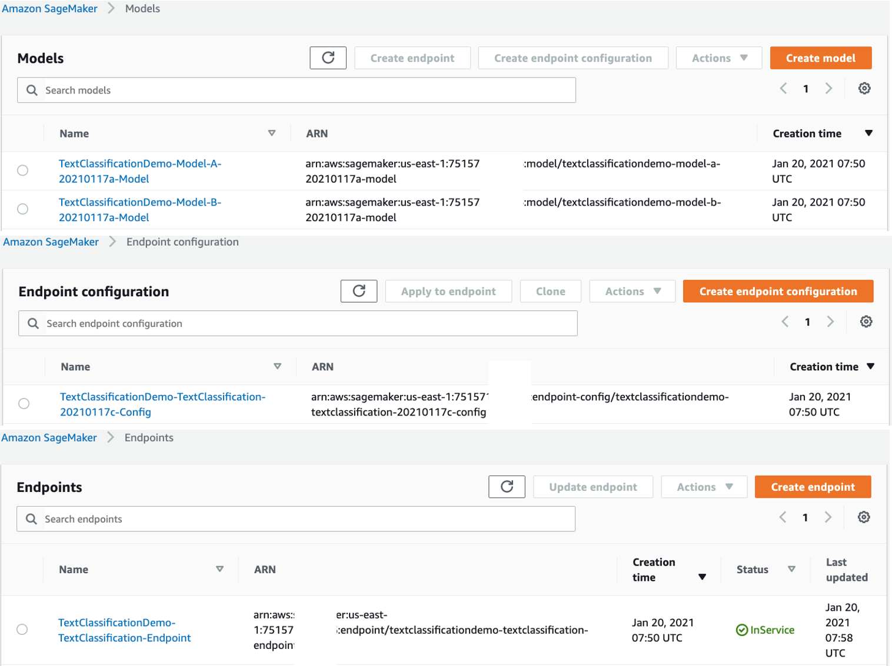

## **About CDK-Project**

The `cdk.json` file tells the CDK Toolkit how to execute your app.

And the more usuful CDK commands are

- `cdk list`        list up CloudFormation Stacks
- `cdk deploy`      deploy this stack to your default AWS account/region
- `cdk diff`        compare deployed stack with current state
- `cdk synth`       emits the synthesized CloudFormation template
- `cdk destroy`     remove resources

## **How to clean up**

Execute the following command, which will destroy all resources except S3 Buckets. So destroy these resources in AWS web console manually.

```bash
sh script/destroy_stacks.sh
```

## **Security**

See [CONTRIBUTING](CONTRIBUTING.md#security-issue-notifications) for more information.

## **License**

This library is licensed under the MIT-0 License. See the LICENSE file.